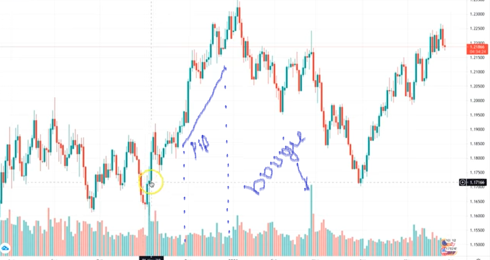

# Trading base
Le trading le metier d'avenir 

## Le Trading c'est quoi ?

* Un métier où on gagne de l'argent sur les variations des prix d'un actif financier.
  
* C'est du commerce en ligne, on achète à un prix pour le revendre plus cher et encaisser la marge.

## Les Différents Actifs Financiers

* Les actions( apple, amazon, disney, tesla,... )
* Le forex( EUR/USD, GBP/USD, NZD/CAD, ... )
* Les indices boursières( dax30, dj30, nas100, ... )
* Les crypto-monnaies( bitcoin, ripple, ethereum, ... )
* Les matières premières( cacao, sucre, coton, ... )
* Les metaux précieux( or, diamant, argent)

## Les Avantages du Trading

* Pas de création de produit
* Pas de recherche de client
* Pas besoin de pub et de com
* besoin d'une plateforme comme MT4
* besoin d'un capital (100 EUR)
* on peut gagner 5/7 24/24
* gros potentiel financier
* liberté géographique

## Grosses Places Boursières
* L'Europe (session européen le matin)
* L'Amérique ( Après midi la session américaine )
* L'Asie (la nuit avec la session asiatique)
* Avec les cripto-monnaie, on peut travailler 7/7

## Inconvenient du Trading
* Métier stressant
* Métier risqué
* Longue période de formation(12-24 mois)
* Taux d'échec élevé(80%)

## Comment Gagner de l'Argent en Trading
Pour cela, on va apprendre à lire les graphiques:
* qu'est ce qu'une bougie
* qu'elle est sa durée
* la différence entre un point d'achat et un point où on revent s'appelle pipe
  

## Quelques Gargons
* bougie japonaise
* analyse technique
* monnaie management