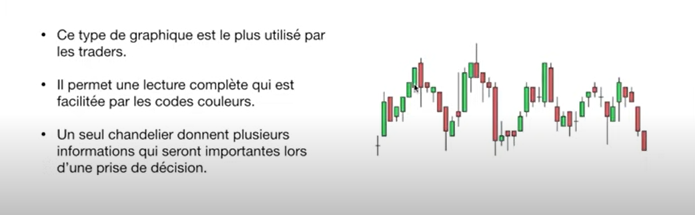
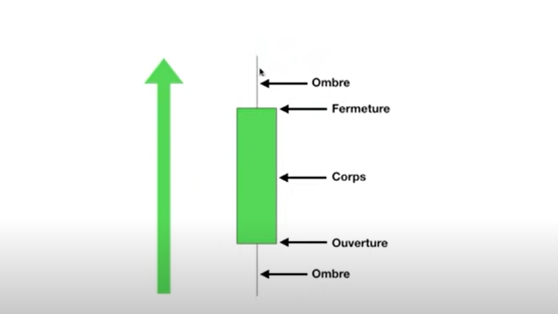
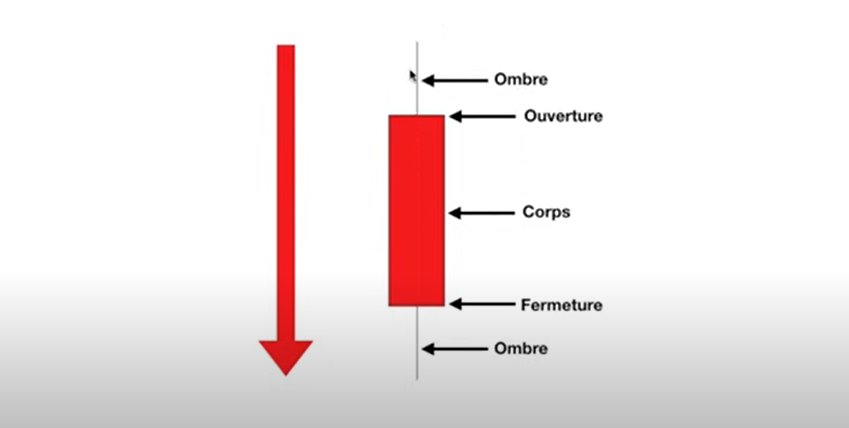
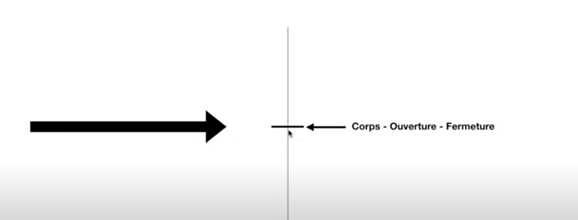

# BOUGIE JAPONAISE

## LA BOUGIE JAPONAISE DE CONTRÔLE (ultra rentable)

La bougie japonaise en trading est très pertinente. 
Lors de l'analyse technique en trading il est judicieux de repérer cette bougie japonaise car elle va vous dire beaucoup de chose sur la psychologie des trader et vous donner des indications pour les traders à venir que vous pourriez prendre.

## Un Chadelier

* Quand un chandelier est vert ça veut qu'il y a une hausse:
  
  

* Quand un chandelier est rouge ça veut qu'il y a une base:
  
  

* Quand un chandelier est barre ça veut que les actions sont restées constantes:
  
  

  ## Caractéristique d'un Chandelier

* **Ouverture**: les marchés ont commencé à cet androit là.
* **Fermeture**: les marchés ont cloturé à cet androit là.
* **Ombre**: entre le moment où les marchés ont ouvert et ou les marchés ont fermé l'évolution totale de cet indice sur cette période.
  C'est à dire le movement le plus haut et le plus bas de l'action durant cette période.